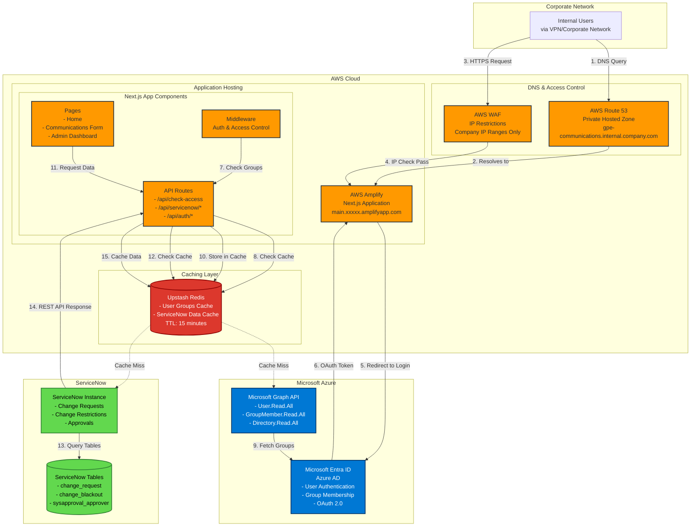
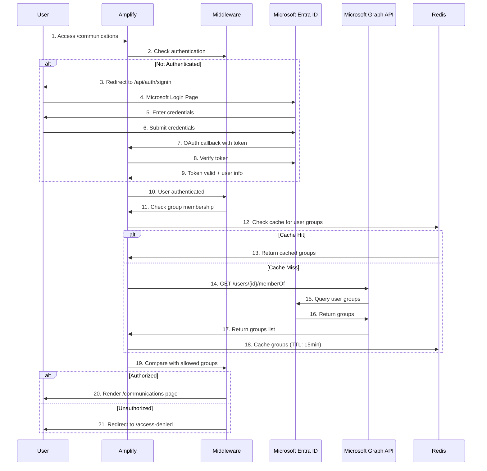
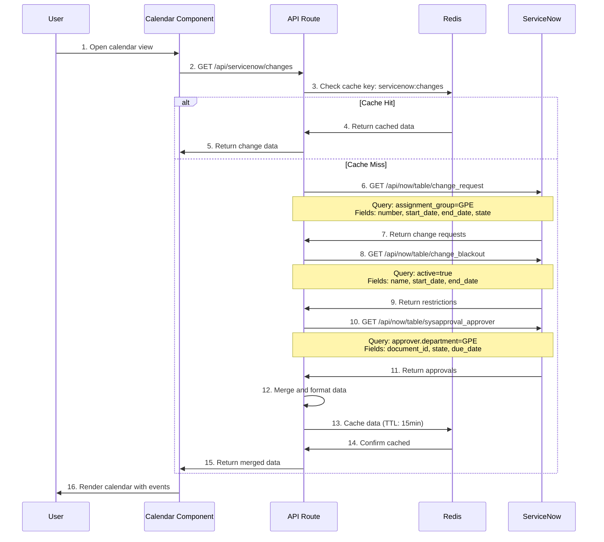
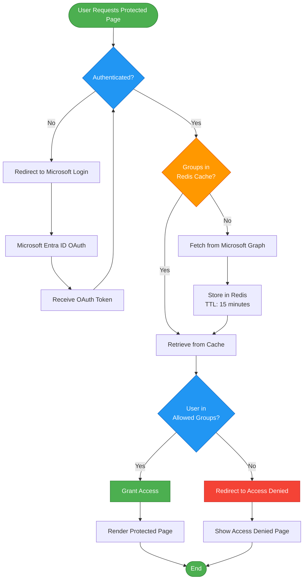
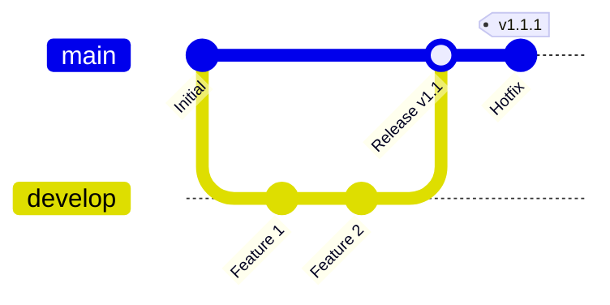
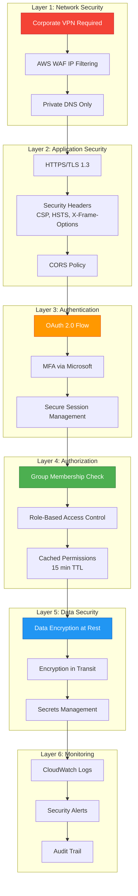
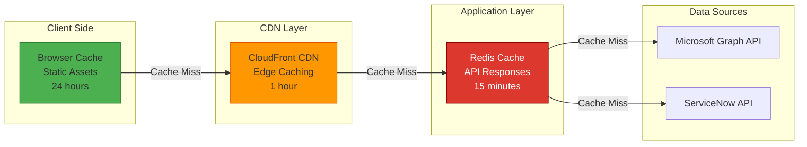
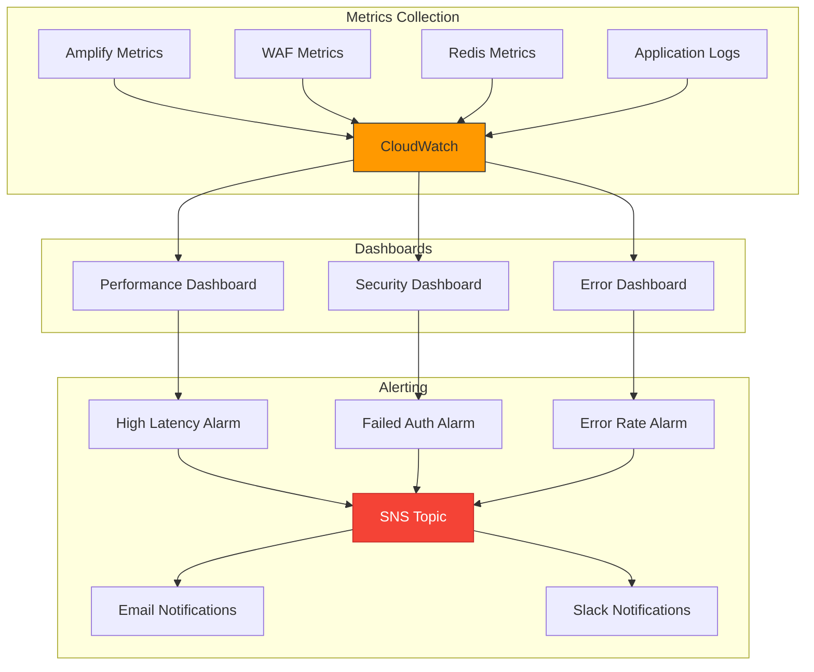

# GPE Communications Tool - Detailed AWS Architecture

## Table of Contents
1. [High-Level Architecture](#high-level-architecture)
2. [Component Details](#component-details)
3. [Data Flow Diagrams](#data-flow-diagrams)
4. [Cost Estimates](#cost-estimates)
5. [CI/CD Pipeline](#cicd-pipeline)
6. [Security Architecture](#security-architecture)

---

## High-Level Architecture



---

## Component Details

### 1. Authentication Flow (Detailed)



### 2. ServiceNow Integration Flow (Detailed)



### 3. Access Control Decision Flow



---

## Cost Estimates

### Monthly Cost Breakdown (Estimated)

| Service | Usage Estimate | Unit Cost | Monthly Cost | Notes |
|---------|---------------|-----------|--------------|-------|
| **AWS Amplify** | | | | |
| - Build minutes | 100 min/month | $0.01/min | $1.00 | CI/CD builds |
| - Hosting | 5 GB storage | $0.023/GB | $0.12 | Static assets |
| - Data transfer | 15 GB/month | $0.15/GB | $2.25 | First 15GB free |
| **Route 53** | | | | |
| - Hosted zone | 1 private zone | $0.50/zone | $0.50 | Internal DNS |
| - Queries | 1M queries | $0.40/M | $0.40 | DNS lookups |
| **AWS WAF** | | | | |
| - Web ACL | 1 ACL | $5.00/month | $5.00 | IP restrictions |
| - Rules | 2 rules | $1.00/rule | $2.00 | IP set rules |
| - Requests | 10M requests | $0.60/M | $6.00 | Request filtering |
| **Upstash Redis** | | | | |
| - Storage | 100 MB | Free tier | $0.00 | Cache storage |
| - Commands | 10K/day | Free tier | $0.00 | Up to 10K daily |
| **Microsoft Azure** | | | | |
| - Entra ID | Included | Free | $0.00 | Basic features |
| - Graph API | 100K calls/month | Free tier | $0.00 | Within limits |
| **ServiceNow** | | | | |
| - API calls | Existing license | $0.00 | $0.00 | Covered by license |
| | | **TOTAL** | **~$17.27/month** | |

### Cost Optimization Tips

1. **Amplify Builds**: Use build caching to reduce build minutes
2. **WAF**: Consider if IP restrictions are necessary or use Amplify's built-in access control
3. **Redis**: Stay within free tier limits (10K commands/day)
4. **Data Transfer**: Enable compression to reduce bandwidth

### Scaling Costs

| Users | Monthly Cost | Notes |
|-------|--------------|-------|
| 10-50 | $17-25 | Current estimate |
| 50-200 | $25-50 | Increased data transfer |
| 200-500 | $50-100 | May need Redis paid tier |
| 500+ | $100-200 | Consider reserved capacity |

---

## CI/CD Pipeline

```mermaid
flowchart LR
    subgraph "Developer Workflow"
        Dev[Developer] -->|1. Code Changes| Local[Local Development]
        Local -->|2. Git Commit| Git[Git Repository]
    end

    subgraph "GitHub"
        Git -->|3. Push| GitHub[GitHub Repository<br/>main branch]
        GitHub -->|4. Webhook| Amplify
    end

    subgraph "AWS Amplify"
        Amplify[Amplify Console] -->|5. Trigger Build| Build[Build Process]
        
        Build --> Install[Install Dependencies<br/>npm install]
        Install --> Lint[Run Linting<br/>npm run lint]
        Lint --> TypeCheck[TypeScript Check<br/>tsc --noEmit]
        TypeCheck --> BuildApp[Build Next.js<br/>npm run build]
        BuildApp --> Test[Run Tests<br/>npm test]
        
        Test -->|Pass| Deploy[Deploy to CDN]
        Test -->|Fail| Notify[Notify Developer]
        
        Deploy --> Edge[Edge Locations<br/>CloudFront CDN]
    end

    subgraph "Post-Deployment"
        Edge -->|6. Health Check| Health[Health Check API]
        Health -->|Success| Live[Live Application]
        Health -->|Failure| Rollback[Auto Rollback]
        
        Live -->|7. Monitor| CloudWatch[CloudWatch Logs]
        CloudWatch -->|Alerts| SNS[SNS Notifications]
    end

    subgraph "Environment Variables"
        Secrets[Amplify Secrets Manager] -.->|Inject at Build| Build
        Secrets -.->|Runtime Vars| Edge
    end

    Notify -.->|Email| Dev
    SNS -.->|Email/Slack| Dev

    style Build fill:#FF9900,stroke:#232F3E
    style Deploy fill:#4CAF50,stroke:#2E7D32
    style Test fill:#2196F3,stroke:#1565C0
    style Rollback fill:#f44336,stroke:#c62828
```

### Build Configuration (amplify.yml)

```yaml
version: 1
frontend:
  phases:
    preBuild:
      commands:
        - npm ci
    build:
      commands:
        - npm run lint
        - npm run build
  artifacts:
    baseDirectory: .next
    files:
      - '**/*'
  cache:
    paths:
      - node_modules/**/*
      - .next/cache/**/*
```

### Deployment Stages

| Stage | Duration | Actions | Rollback |
|-------|----------|---------|----------|
| **Pre-Build** | 1-2 min | Install dependencies, cache check | N/A |
| **Build** | 3-5 min | Lint, type check, build Next.js | N/A |
| **Test** | 1-2 min | Run unit tests, integration tests | Stop deployment |
| **Deploy** | 2-3 min | Upload to S3, invalidate CDN | Auto rollback |
| **Verify** | 1 min | Health checks, smoke tests | Auto rollback |
| **Total** | **8-13 min** | | |

### Branch Deployment Strategy



| Branch | Environment | URL | Auto-Deploy |
|--------|-------------|-----|-------------|
| `main` | Production | `gpe-communications.internal.company.com` | ✅ Yes |
| `develop` | Staging | `develop.xxxxx.amplifyapp.com` | ✅ Yes |
| `feature/*` | Preview | `feature-name.xxxxx.amplifyapp.com` | ✅ Yes |

---

## Security Architecture

### Defense in Depth Layers



### Security Controls Matrix

| Control | Implementation | Status | Priority |
|---------|---------------|--------|----------|
| **Network** | | | |
| IP Whitelisting | AWS WAF | ✅ Configured | High |
| Private DNS | Route 53 Private Zone | ✅ Configured | High |
| VPN Required | Corporate VPN | ✅ Required | High |
| **Authentication** | | | |
| OAuth 2.0 | Microsoft Entra ID | ✅ Implemented | Critical |
| MFA | Microsoft MFA | ✅ Enforced | Critical |
| Session Timeout | 8 hours | ✅ Configured | Medium |
| **Authorization** | | | |
| Group-Based Access | Microsoft Graph | ✅ Implemented | Critical |
| RBAC | Custom middleware | ✅ Implemented | High |
| Permission Caching | Redis 15min TTL | ✅ Implemented | Medium |
| **Data Protection** | | | |
| HTTPS Only | Amplify SSL | ✅ Enforced | Critical |
| Secrets Management | Amplify Env Vars | ✅ Configured | Critical |
| Data Encryption | AES-256 | ✅ Enabled | High |
| **Monitoring** | | | |
| Access Logs | CloudWatch | ✅ Enabled | High |
| Error Tracking | CloudWatch | ✅ Enabled | Medium |
| Security Alerts | SNS | ⏳ Pending | Medium |

### Compliance Considerations

- **Data Residency**: All data stored in AWS US regions
- **Access Logs**: Retained for 90 days
- **Audit Trail**: All authentication/authorization events logged
- **Encryption**: TLS 1.3 for transit, AES-256 for rest
- **Password Policy**: Enforced via Microsoft Entra ID

---

## Performance Optimization

### Caching Strategy



### Performance Metrics

| Metric | Target | Current | Status |
|--------|--------|---------|--------|
| Time to First Byte (TTFB) | < 200ms | ~150ms | ✅ Good |
| First Contentful Paint (FCP) | < 1.5s | ~1.2s | ✅ Good |
| Largest Contentful Paint (LCP) | < 2.5s | ~2.1s | ✅ Good |
| Time to Interactive (TTI) | < 3.5s | ~3.0s | ✅ Good |
| Cumulative Layout Shift (CLS) | < 0.1 | ~0.05 | ✅ Good |

---

## Disaster Recovery

### Backup Strategy

| Component | Backup Method | Frequency | Retention |
|-----------|--------------|-----------|-----------|
| Application Code | GitHub | On commit | Unlimited |
| Redis Cache | No backup needed | N/A | Ephemeral |
| Configuration | Amplify Console | On change | 30 days |
| Environment Variables | Amplify Secrets | On change | Unlimited |

### Recovery Procedures

**Scenario 1: Application Failure**
- Amplify auto-rollback to last known good deployment
- RTO: < 5 minutes
- RPO: Last successful deployment

**Scenario 2: Redis Failure**
- Application continues with direct API calls
- Performance degradation only
- Auto-recovery when Redis available

**Scenario 3: Microsoft Entra ID Outage**
- Existing sessions continue to work
- New logins blocked until service restored
- No data loss

---

## Monitoring & Alerting

### CloudWatch Dashboards



### Alert Thresholds

| Alert | Threshold | Action | Priority |
|-------|-----------|--------|----------|
| Error Rate | > 5% | Investigate immediately | Critical |
| Response Time | > 3s | Check performance | High |
| Failed Logins | > 10/min | Check for attacks | High |
| Redis Errors | > 1% | Check Redis health | Medium |
| Build Failures | Any | Check build logs | Medium |

---

## Export Formats

This documentation is available in multiple formats:

1. **Markdown**: `docs/AWS_ARCHITECTURE_DETAILED.md` (this file)
2. **PDF**: Generate using `pandoc` or Markdown to PDF converter
3. **Visio**: Import Mermaid diagrams using Mermaid to Visio converter
4. **Draw.io**: Import Mermaid diagrams directly
5. **PowerPoint**: Export diagrams as images and embed

### Generate PDF

```bash
# Using pandoc
pandoc docs/AWS_ARCHITECTURE_DETAILED.md -o AWS_Architecture.pdf

# Using markdown-pdf
npm install -g markdown-pdf
markdown-pdf docs/AWS_ARCHITECTURE_DETAILED.md
```

### Generate Images from Mermaid

```bash
# Using mermaid-cli
npm install -g @mermaid-js/mermaid-cli
mmdc -i docs/AWS_ARCHITECTURE_DETAILED.md -o diagrams/
```

---

## Additional Resources

- [ARCHITECTURE.md](../ARCHITECTURE.md) - Architecture Decision Record
- [ACCESS_CONTROL_SETUP.md](./ACCESS_CONTROL_SETUP.md) - Access control setup guide
- [AWS Amplify Documentation](https://docs.amplify.aws/)
- [Microsoft Graph API Documentation](https://learn.microsoft.com/en-us/graph/)
- [ServiceNow REST API Documentation](https://developer.servicenow.com/dev.do)

---

**Document Version**: 1.0  
**Last Updated**: 2025-01-10  
**Maintained By**: GPE DevOps Team
